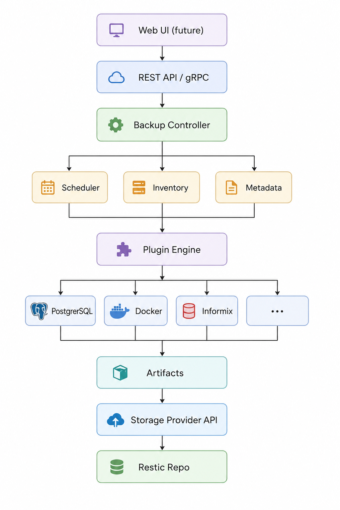
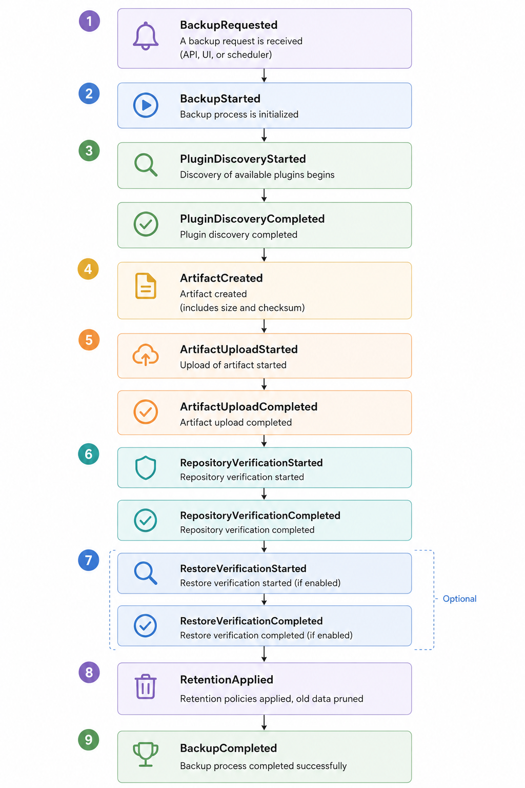
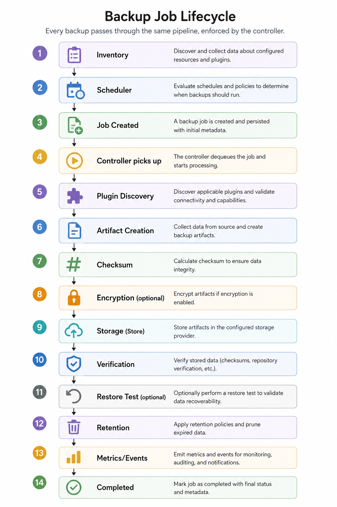
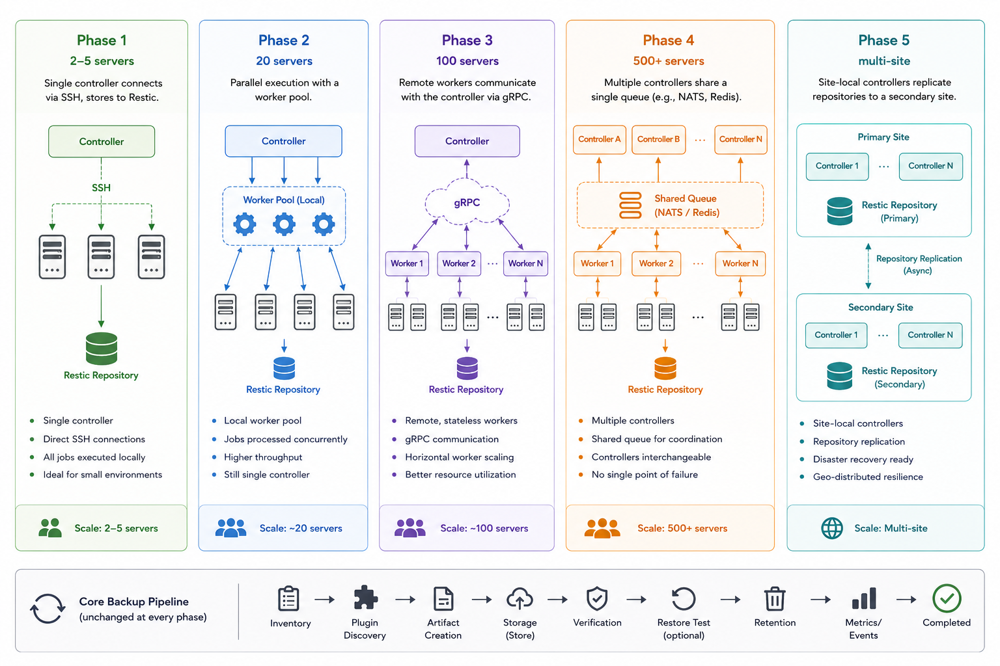

# Architecture

## High‑Level System Diagram

Each layer owns exactly one responsibility:

- **Inventory**: defines *what* should be backed up, *when*, and with *which* policies.
- **Scheduler**: creates backup jobs based on inventory rules; never performs backups.
- **Controller**: reads jobs, loads plugins, executes workflows, coordinates storage, emits events.
- **Plugin Engine**: executes a plugin's `Discover()`, `Backup()`, `Restore()`, `Verify()` contracts.
- **Storage Provider**: stores and retrieves artifacts, enforces retention, verifies integrity.
- **Metadata Service**: records snapshots, artifacts, restore jobs, and events.
- **API**: exposes the controller and metadata for external consumption.
- **Event System**: emits structured events at every lifecycle step.

## Component Responsibilities

### Inventory

Inventory is the source of truth for all infrastructure. It describes:

- Hosts (IP, SSH credentials, labels)
- Plugin assignments (which plugins run on each host)
- Retention policies (daily/weekly/monthly/yearly)
- Schedules (cron expressions)
- Capabilities (e.g., “this host can only run filesystem backups”)

Inventory is initially YAML‑based, later migratable to a database or Kubernetes
CRDs. The controller reads inventory and builds an internal execution plan.

### Scheduler

The scheduler's only job is to create jobs at the right time. A job is a
request to back up a specific host‑plugin combination with a specific retention
profile.

Jobs are placed into a `Queue` (a port/interface, per the hexagonal
architecture standard below). The controller then picks up jobs and processes
them. This decoupling allows:

- Concurrency control (limit how many jobs run simultaneously)
- Priority queuing (production databases before file shares)
- Maintenance window awareness
- Dependency scheduling (e.g., “back up filesystem after the database dump”)

**Phase 1**: the scheduler runs in-process within the controller binary, and
`Queue` is backed by an in-memory implementation - single binary, no external
dependencies. Because `Queue` is an interface rather than a concrete data
structure, later phases (a shared queue via NATS/Redis, for multi-controller
deployments - see Scalability Model) are a new adapter, not a redesign of the
scheduler or controller.

**Phase 1 implementation notes**: the scheduler (`internal/scheduler`) parses
each inventory server's `schedule` field as a standard 5-field cron
expression (via `robfig/cron`) and validates all of them at startup - a bad
expression fails `bop controller` immediately rather than silently never
firing. A server with no `schedule` is skipped and stays manual-only,
triggered with `bop backup`. Each tick creates one job per plugin configured
on that server (a host running both `postgres` and `filesystem` gets two
jobs, not one), persists each as `queued` before enqueueing (see the `Queue`
durability contract above), and emits `BackupRequested`.

`bop controller` runs a single serial consumer that drains the `Queue` and
processes one job at a time - not a worker pool. This is deliberate for
Phase 1: `ApplyRetention`'s `restic forget --prune` takes an exclusive
repository lock, so concurrent jobs against the same repository would
collide on it. `controller.concurrency` is documented but not yet enforced;
honoring it requires a per-repository lock or prune-serialization strategy
that a future phase's worker pool will need to add. On startup,
`bop controller` also re-enqueues any job still in the metadata service's
`queued` state (from a previous run's crash or a full `Queue`) before
starting the scheduler and consumer, so the durability contract's recovery
promise is actually kept rather than aspirational.

### Controller

The controller is the brain. It loops over the queue, and for each job:

1. Reads the inventory entry for the host and plugin.
2. Instantiates the appropriate plugin (via the Plugin Engine).
3. Calls `plugin.Discover()` to identify resources.
4. For each resource, calls `plugin.Backup()` → obtains an **artifact**.
5. Calls `plugin.Verify()` as a structural sanity check on the artifact (fails fast, before any expensive work happens).
6. Computes a checksum of the artifact.
7. (Optional) Encrypts the artifact.
8. Passes the artifact to the configured storage provider (`Store()`).
9. Records metadata (snapshot ID, host, plugin, timestamps, size, checksum).
10. Runs `StorageProvider.Verify()` to confirm the snapshot is intact.
11. Optionally runs `plugin.Restore()` into a temp location to test recoverability.
12. Applies retention policies.
13. Emits events and exports metrics.

Note: the [Backup Job Lifecycle diagram](#backup-job-lifecycle) below predates
this three-tier verification split and should be regenerated to add the
`plugin.Verify()` step between "Artifact Creation" and "Checksum".

The controller never knows how PostgreSQL dumps data. It only calls the
plugin's methods. This design lets you add new databases without touching a
single line of controller code.

### Plugin Engine

Each plugin implements the `BackupPlugin` interface. Plugins are invoked
through a registry, which decouples "what plugin runs" from "how it runs":

- **Phase 1**: core plugins (postgres, filesystem) are compiled directly into
  the `bop` binary and registered in-process. No separate install step.
- **Later**: the registry can resolve plugins as external binaries/processes
  (scanning `plugins.dir`) for isolation and third-party/out-of-tree plugins.

Because plugin authors only ever implement the `BackupPlugin` interface, this
transition doesn't change plugin code - only the Plugin Engine's resolution
strategy. Plugins receive credentials and configuration from the inventory.
They return artifacts and metadata. Plugins are independently versioned.

### Storage Provider

The storage provider is an abstraction over the backup repository. The initial
implementation wraps Restic. Future implementations could wrap Borg, MinIO, or
S3 directly. The interface (`Store`, `Retrieve`, `Verify`, `Delete`,
`Snapshots`, `ApplyRetention`) is the only thing the controller knows.

This means you can change storage backends without altering any plugin or
controller code.

### Metadata Service

The metadata service stores information *about* backups, not the backup data
itself. It records:

- Hosts and their inventory definitions
- Plugin executions (start, end, status)
- Snapshot IDs, sizes, checksums
- Restore operations
- Verification results
- Events

Initially backed by SQLite, the service can scale to PostgreSQL for multi‑node
deployments. This data is essential for auditing, reporting, and dashboards.

**Crash recovery (Phase 1 default):** on controller startup, any job whose
recorded status is still `in_progress` from a previous run is marked `failed`,
not resumed. Resuming a partially-executed job safely (mid-upload, mid-verify)
is real complexity that isn't worth building until the fail-and-let-the-
scheduler-retry behavior has proven insufficient in practice.

### API

The API exposes the controller and metadata. The original design called for
**gRPC** with a REST gateway; endpoints were meant to allow:

- Listing inventory and statuses
- Triggering ad‑hoc backups
- Starting restores
- Querying snapshot history
- Viewing events and metrics

**Phase 1 implementation notes** (v1 scope, decided 2026-08-05): REST only -
gRPC is deferred until something actually needs it, not built speculatively
alongside REST. Read-only for v1 - triggering backups/restores stays
CLI-only until the read surface (and its auth) has proven itself; adding
mutating endpoints is a later, separate decision. Auth is a static bearer
token (`api.tokens_file`/`api.token_env`, same file-or-env delivery every
other BOP secret uses) - no anonymous access, no OIDC/mTLS yet. "Viewing
events" is not implemented as an endpoint yet - `GET /v1/events` is a
separate, not yet scoped, follow-up - but the durable event store it would
need now exists (see the Event System section below); the earlier gap was
"there's nothing to query," not "there's no endpoint." `internal/api`
implements this; see
[Configuration Reference](03-getting-started/configuration.md) for the
`api.*` config block.

### Event System

Every meaningful action emits a structured event. Example event flow for a
backup job:

Events are written to a log and pushed to subscribers (e.g., a notification
system, metrics pipeline, or audit trail). They require zero extra engineering
inside plugins – the controller emits them automatically.

**Phase 1 implementation notes**: the documented core backup pipeline
(see the Scalability Model diagram) includes a `Metrics/Events` step at
every phase, so `internal/metrics` is Phase 1 scope, not deferred.
`metrics.Publisher` is exactly another `events.Publisher` subscriber
alongside `LogPublisher`, wired into the same `events.Multi` fan-out - so,
per the paragraph above, recording metrics needed zero extra
instrumentation calls inside the controller or plugins. It exposes
`bop_jobs_total{host,plugin,status}`, `bop_job_duration_seconds{host,plugin}`,
`bop_artifacts_created_total{host,plugin}`, `bop_retention_applied_total{host}`,
and `bop_restore_verifications_completed_total{host,plugin}` on
`metrics.port`/`metrics.path` (default `:9090/metrics`), served by
`bop controller` for as long as it runs - one-shot commands (`bop backup`,
etc.) still record into a registry, but nothing serves it since the
process exits immediately after.

**Durable event storage** (added 2026-08-05): `metadata.EventPublisher` is
a third `events.Publisher` subscriber in the same `events.Multi` fan-out,
persisting every event to an `events` table via `metadata.Store` - the
same zero-extra-instrumentation property applies. Unlike `jobs`/
`snapshots` (one row per job, never pruned), events fire many times per
job, so the table is bounded by age: `metadata.event_retention` (default
30 days) plus a periodic pruner (`internal/cli`'s `runEventPruner`, hourly,
plus once immediately on `bop controller` startup so a controller that was
down doesn't wait a full interval to catch up). `metadata.Store.ListEvents`
exists for this - most-recent-first, no filtering yet - but nothing reads
it over the network today; that's `GET /v1/events`, a separate follow-up
(see the API section above).

## Backup Job Lifecycle

Every backup passes through the same pipeline, enforced by the controller:

No plugin may bypass steps. This ensures consistent behaviour across every
data source.

## Scalability Model

BOP's architecture scales incrementally.

At every phase, the core backup pipeline remains unchanged.

## Kubernetes Migration Path

- Today: Plugins produce artifacts from local Docker volumes or SSH files.
- Tomorrow: Plugins can leverage CSI snapshots for persistent volumes. The
  artifact becomes a snapshot ID. The controller, scheduler, and storage
  interface remain exactly the same.

This design ensures BOP can evolve with infrastructure without rewriting its
core.

## Engineering Standards

- **Hexagonal Architecture:** Ports (interfaces) and adapters (implementations).
- **Dependency Injection:** All components receive their dependencies explicitly.
- **SOLID Principles:** Interface‑first, small focused types.
- **Structured Logging:** JSON/structured logs for easy ingestion.
- **Idempotent Operations:** Restore, verify, and retention can be re‑run safely.
- **Semantic Versioning:** Backward‑compatible Plugin SDK.
- **Comprehensive Testing:** Unit, integration, and end‑to‑end tests with Testcontainers.

## Technology Stack

| Layer             | Technology                |
|-------------------|---------------------------|
| Language          | Go 1.25+                  |
| CLI               | Cobra                     |
| Configuration     | Viper                     |
| API               | gRPC + REST gateway       |
| Serialization     | Protocol Buffers          |
| Metadata          | SQLite → PostgreSQL       |
| DB codegen (recommended) | SQLC for type-safe queries |
| Logging           | `slog` or `zap`           |
| Metrics           | Prometheus                |
| Tracing           | OpenTelemetry             |
| Scheduler         | Custom cron + job queue   |
| Storage           | Restic via abstraction    |
| SSH               | `golang.org/x/crypto/ssh` |
| Testing           | Go test + Testcontainers  |
| CI                | GitHub Actions            |
| Containers        | Docker                    |
| Future Orchestr.  | Kubernetes                |